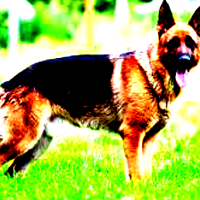

#  ML Programming Problem
#### Adversarial Attacks on Vision Models (for images of Dogs)
## 1. Project Overview
This project aims to generate an adversarial image by introducing human-imperceptible noise, primarily targeting a Convolution Neural Network (CNN) vision model, VGG-13, alongside brief exploration of a Vision Transformer (ViT) model, vit_b_16. In the interest of “keeping it simple”, the scope is limited to generating adversarial images of dogs using a subset of cat target classes. The methodology involves using a white-box technique known as Projected Gradient Descent (PGD), to iteratively modify the input image by slightly perturbing the pixels. Across all tests, the algorithm consistently misled the model and adversarial images were misclassified, though it never reached the intended target class itself with any significant percentage confidence.

## 2. Motivation and Scope
The main objective of this short project is to demonstrate my skill in outlining a research problem, translating the literature into a programmed algorithm, coding and documenting to a production standard, presenting results in a clear and concise manner, and understanding what the primary pitfalls and further work would be to move forward positively. 

I am keen to understand the underlying mechanisms behind transformers, where I am also intricately aware of the business use cases and societal implications works like this could have. This study however, focuses particularly on building an adversarial algorithm for CNN models as they are easier to tackle with existing adversarial methods given the time constraints, whereas effective deception of a transformer model generally requires in depth understanding and manipulation of self-attention heads. Nevertheless, I secondarily test the adversarial generation algorithm on a transformer model to act as a point of comparison.

I approach the problem of effective adversarial image generation for vision models with the most classic of all classification tasks - dogs vs cats. To be clear, the reader should be able to add any image into the “images” folder with a specific target class and the model should generate an imperceptible adversarial image. The goal is to have the model classify the adversarial image of a dog as a cat. In this specific case, the images were of 4 random dogs, and the target classes were of 4 random cats.

This is, above all else, a fun problem. So, I hope you have as much fun reading through it as I did solving it.

## 3. Background Research
CNNs in general have been shown to have incredible predictive capabilities, especially when scaled up. Despite their success, CNN models remain vulnerable to adversarial attacks, which can significantly degrade their performance in critical applications and could pose security and safety risks. The same can be said of vision transformers, where the robustness against adversarial examples has been a recently developing challenge.

Mahmood et al. (2021), in their “On the Robustness of Vision Transformers to Adversarial Examples”, proposed a novel attack method called Self-Attention Gradient Attack (SAGA), which specifically targets the self-attention mechanism in vision transformers. SAGA generates adversarial examples by manipulating the attention maps in the model, leading to misclassification. The authors demonstrated the effectiveness of SAGA on several vision transformers variants and highlighted the importance of considering the unique architectural properties of transformers when designing adversarial attacks.

Additionally, Fu et al. (2021), in their “Patch-fool” paper conducted a comprehensive study to explore the transferability of adversarial attacks across different neural network architectures, specifically focusing on the interplay between CNNs and vision transformers. They found that adversarial examples generated for CNNs can successfully fool vision transformers, indicating a degree of transferability between the two architectures. That is to say that existing adversarial attack methods designed for CNNs may also be effective against ViTs.

Adversarial attacks on CNN models exclusively have been extensively studied in the literature. Two of the most well-known techniques are the Fast Gradient Sign Method (FGSM) and Projected Gradient Descent (PGD).

**Fast Gradient Sign Method (FGSM)**:
Introduced by Goodfellow et al. (2014) in their paper "Explaining and Harnessing Adversarial Examples", FGSM is a simple yet effective adversarial attack technique. It generates adversarial examples by adding a small perturbation to the input image in the direction of the the loss function gradient with respect to the input.

**Projected Gradient Descent (PGD)**:
Proposed by Madry et al. (2017) in their paper "Towards Deep Learning Models Resistant to Adversarial Attacks", PGD is essentially an iterative variant of FGSM. It applies FGSM multiple times with a smaller step size. Each result is projected back onto an epsilon-ball around the original input after each step to ensure that the perturbation remains within specified bounds.

Other notable adversarial attack techniques include:
* Carlini & Wagner (C&W) Attack (Carlini and Wagner, 2017)
* Jacobian-based Saliency Map Attack (JSMA) (Papernot et al., 2016)

These attacks have been successfully applied to various CNN architectures, including VGGNet, ResNet, and Inception models, demonstrating the vulnerability of CNNs to adversarial examples. The specific type of attack concerning this study is PGD for it’s aforementioned effectiveness and simplicity.

## 4. Methodology and Inputs
On recommendation (found in the problem statement), I have chosen to use a classic pytorch library CNN vision model - VGG-13 - for adversarial generation and testing as it has been widely documented and tested against in the literature.The same can be said for vision transformer vit_b_16, which is why I have secondarily chosen to test it with the very same methodology; though I am aware that it should be more robust than the CNN and would require its own unique methods to be effectively deceived. The two models have trainable parameters on the same order of magnitude, at approximately 100 million.

The crux of the adversarial generation is an algorithm which uses the PGD technique to perturb image pixels with the cross entropy loss between image and adversary, bounded by some epsilon, in an iterative manner. This iterative ability and consequent robustness is the main reason why I’ve chosen to use PGD over the Fast Gradient Sign Method (FGSM) in this context. It allows for more control over the generation process by adjusting the number of iterations and the step size, enabling a more fine-grained exploration of the adversarial space and the models' robustness to different levels of perturbation.

Below is the pseudocode outline for the PGD algorithm:

    function generateAdversarialImage(model, input, target, epsilon, steps, alpha):
        # Add random noise within epsilon range
        adv_input += random_noise(epsilon)
        make sure adv_input is a valid image
        
        repeat steps amount of times:
            # Get model adversarial image output, and compute the loss
            output = model(adv_input)
            loss = CrossEntropyLoss(output, target)
            compute gradients
            
            # Update adv_input based on gradients
            adv_input += alpha * sign(gradients)
            
            # Keep perturbations within epsilon range
            perturbation = limit(adv_input - input, -epsilon, epsilon)
            adv_input = limit(input + perturbation, 0, 1)
    return adv_input
    
Where epsilon controls the magnitude of the perturbation, limiting how much the pixels can change by, and alpha determines the step size in each iteration, meaning that a larger alpha can lead to faster convergence but may then overshoot the optimal perturbation. These hyperparameters were fine tuned for VGG-13.

In terms of inputs, every dog image has had an adversarial image generated for every category of cat that has been specified. Then top 3 originally classified categories as well as the top 3 adversarial categories are generated, as well as the confidence in each prediction. I have randomly picked 4 categories of dog from the 1000 class list, and found appropriate pictures online. 

The original dog images/classes are: 235 - german shepherd, 254 - pug, 180 - staffordshire terrier, and 151 - chihuahua. 

Similarly, the 4 categories of cat (of which there are very few to choose from) from the 1000 class list are: 282 - tiger cat, 283 - persian cat, 284 - siamese, and 285 - egyptian cat. 

This results in a total of 16 adversarial images per model tested.

## 5. Results and Discussion

The full results can be viewed in the respective “results” Excel files, where there is one for the VGG-13 model, and one for the vit_b_16 model.

Below is Table 1, summarizing the results VGG-13, where the result for any target class (e.g., 282 - tiger cat) is broadly representative of the other results.

### Table 1: VGG-13 adversarial image for 282 - tiger cat target class

| Image | Original Top Prediction  | Original Top Confidence | Adversarial Top Prediction | Adversarial Top Confidence |
|-------|--------------------------|-------------------------|----------------------------|----------------------------|
| dog1  | German shepherd          | 0.955                   | Goldfish                   | 0.650                      |
| dog2  | Pug                      | 0.910                   | Ibex, Capra ibex           | 0.112                      |
| dog3  | Staffordshire terrier    | 0.875                   | Bloodhound, Sleuthhound    | 0.180                      |
| dog4  | Chihuahua                | 0.951                   | Kelpie                     | 0.719                      |

In general, the CNN model was quite easily convinced that the image was not a class of dog, but would instead have confidence in a wide range of classes from, 1- goldfish to various other classes of dogs. It exhibited quite unstable and unpredictable behaviour, meaning that slight perturbations massively affected the model’s understanding of the image.

The objective of this adversarial study was to get the models to misclassify a dog as a cat. Dogs and cats have semantically and visually similar identities, so it would be expected that vision models are susceptible to this kind of attack. In other words, it seems intuitive that models should more readily misclassify dog images as cats with only slight perturbation as the two are not “far apart” in terms of the features and learned representations. 

The opposing force here could be that, as per the ImageNet 1000 class list, there are 118 purely dog classes, while there are only 13 cat and cat-related classes in the imagenet dataset. Therefore, without looking into the training data itself, it is reasonable to suggest that the vision model has a much more detailed understanding of “dog” than “cat” and it may therefore be that much more difficult to convince the model that a dog is a cat.

Note that the generated adversarial images appear to be distorted into a square shape with harsher colours and look more pixelated. A highly human-perceptible change. Strictly speaking however, the differences between adversarial images themselves are imperceptible, i.e. all the noise appears to be the same. So, the distortions may simply be due to the transformations the image has to go through in order to be formulated correctly in the network, but this is not for certain and would require further investigation.

The algorithm was also directly tested against the vision transformer vit_b_16. Below are the results for the model in Table 2, as well as a general discussion on the attack and comparison between models.

### Table 2: vit_b_16 adversarial image for 282 - tiger cat target class

| Image    | Original Top Prediction | Original Top Confidence | Adversarial Top Prediction | Adversarial Top Confidence |
|----------|-------------------------|-------------------------|----------------------------|----------------------------|
| dog1  | German shepherd         | 0.852                   | German shepherd            | 0.460                      |
| dog2  | Pug                     | 0.842                   | Pug                        | 0.277                      |
| dog3  | Staffordshire terrier   | 0.703                   | Staffordshire terrier      | 0.176                      |
| dog4  | Chihuahua               | 0.812                   | Chihuahua                  | 0.345                      |

Importantly, neither model had a significant increase in the confidence/ probability that the adversarial image should be classified as the target class (above 0.01%). This was an expected result for the transformer, but also it is a reasonable result for the CNN model since the algorithm could not be particularly specialised towards CNN. This is because the hyperparameter tuning was only conducted across a range of 3 values per parameter due to time and compute constraints. 

The vit_b_16 model consistently had a top ranking prediction which was the same as the original classification, i.e. the chosen dog. Interestingly here, the confidence for each prediction was significantly reduced, sometimes up to 75%, implying that the transformer model is indeed more robust to perturbations generated by this methodology than the CNN.

## 6. What "good" looks like

There exists a general stigma within the research community, and indeed every community, where people would not like to publish a non-positive result. Everyone wants their work to mean something; I definitely do. It is only human, but it definitely is not _good_.

Ofcourse, I would've loved for the adversarial attack algorithm I created to work flawlessly, and to impress on a technical level. This may not have been the case, and yet, I think what I have created and demonstrated in this study has been _good_. I am determined to fail upwards, to move through the uncertainty, to learn all the while, and to inevitably change the world in the process. 

I've clearly documented my process and my thoughts such that anyone coming into this project will be able to understand what the objectives are and what the progress has been. That is especially important in a team setting, where I believe I add the most value with works like this. Additionally, the algorithm I implemented had some success and worked effectively to nudge vision models in a different direction - moving the needle.

Most importantly, I am confident that I have tried my hardest and will continue to try hard in the future.

## 7. Further Work/ Improvements
Overall, the exploration of the PGD attack on vision models provides a very basic foundation for understanding the vulnerabilities of CNN and transformer models to adversarial attacks. In reality, there are several avenues for further exploration and improvement that I would’ve loved to investigate, which could enhance the robustness and generalizability of the findings.

Firstly, when it comes to the transformer model, as aforementioned, a deeper exploration of the attention mechanism would be necessary for effective attack. By closely examining which regions of attention contribute most to the core idea of the image and to what degree those ideas are linked and can be manipulated or bypassed, the basic algorithm could be enhanced significantly. This analysis could involve visualizing attention maps and investigating the relationships between attention heads and their impact on the model's predictions.

Experimenting with various sizes of models could shed light on the scalability of the proposed solutions. While this study utilized the VGG-13 CNN and the vit_b_16 transformer model, investigating the performance of the adversarial attack on larger ViT models would reveal the potential challenges of scale. Furthermore, given the rise of multimodal models in understanding complex inputs, future work could extend the developed mechanisms to these architectures. Multimodal models, which combine visual and textual information, present unique challenges and opportunities for adversarial attacks. 

Another interesting direction for future work could be exploring the reverse scenario: using cat images as the input and targeting dog classes for generation. This investigation could provide insights into the symmetry of the vulnerability and whether the models exhibit similar biases and weaknesses in both directions. In the same vein, to better understand the models' behavior and improve the attack, a more detailed analysis of the training dataset could be beneficial. 

From a technical perspective, ensuring that the output adversarial image maintains the same shape as the input image would enhance the imperceptibility of the attack. This may simply involve refining the image processing pipeline and exploring techniques to minimize distortions - while still effectively fooling the models.

To enhance the rigor and reliability of the findings, several improvements could be made to the evaluation process. Utilizing metrics such as the F1-score, which considers both precision and recall, would provide a more comprehensive assessment of the attack's effectiveness. However, this would require a significantly larger dataset to ensure statistical significance. Also, this study focused only on a limited subset of dog and cat classes, but expanding the scope to include a more diverse set of categories would provide a more comprehensive understanding of the algorithm's effectiveness and limitations in generating adversarial images.

Lastly, to make the code production-ready and ensure its reliability for use in a team setting, implementing unit tests across the board is crucial. It would involve creating test cases for various components of the system, such as image preprocessing, the adversarial generation algorithm itself, and the evaluation mechanisms to catch potential bugs and edge cases.

## 8. Conclusion
To conclude, while the project was a fun exercise and is broadly incomplete, it provides some basic insights into the vulnerabilities of CNN and transformer models to adversarial attacks, and the differences between them. There are numerous opportunities for further exploration and improvement from model size, to training data, and general algorithm investigation. Nevertheless, I believe I have met the main objective of the project, demonstrating my interest, ability, and determination when it comes to researching tough problems.

Thank you for reading through to the end. 

Talk soon,
Ishmail

## 9. References
* Leap Labs, Problem statement document, “ML Programming Problem”, 2024, [not linked]
* “On the Robustness of Vision Transformers to Adversarial Examples”, Kaleel Mahmood and Rigel Mahmood and Marten van Dijk, 2021, arXiv:2104.02610
* “Patch-Fool: are vision transformers always robust against adversarial perturbations”, Yonggan Fu, Shunyao Zhang, Shang Wu, Cheng Wan & Yingyan Lin, 2022, arXiv:2203.08392
* "Explaining and Harnessing Adversarial Examples", Ian J. Goodfellow, Jonathon Shlens, Christian Szegedy, 2014, arXiv:1412.6572
* "Towards Deep Learning Models Resistant to Adversarial Attacks", Aleksander Madry, Aleksandar Makelov, Ludwig Schmidt, Dimitris Tsipras, Adrian Vladu, 2017, 	arXiv:1706.06083
* “Towards Evaluating the Robustness of Neural Networks”, Nicholas Carlini, David Wagner, 2017, arXiv:1608.04644
* “The Limitations of Deep Learning in Adversarial Settings”, Nicolas Papernot; Patrick McDaniel; Somesh Jha; Matt Fredrikson; Z. Berkay Celik; Ananthram Swami, 2016, 10.1109/EuroSP.2016.36
* Pytorch, torchvision, model documentation, vgg13, https://pytorch.org/vision/main/models/generated/torchvision.models.vgg13.html
* Pytorch, torchvision, model documentation, vit_b_16, https://pytorch.org/vision/main/models/generated/torchvision.models.vit_b_16.html
